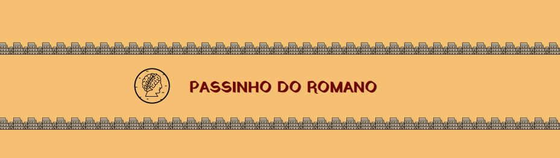

# Passinho do Romano

Quarto miniprojeto do curso de web dev full stack da Resilia Educação. Consiste num site que criptografa e descriptografa mensagens com os métodos Cifra de César e Base 64. O foco dessa atividade foi a manipulação do DOM e eventos com JavaScript.

Minha maior dificuldade foi entender a fórmula para descriptografar a Cifra de César. Depois que consegui compreender a parte matemática (com muita pesquisa e ajuda das e dos colegas), o resto do processo foi só alegria.

Até agora esse foi um dos projetos que mais gostei de fazer e que mais me diverti estilizando.

É possível conferir o site [aqui](https://alonso-estevam.github.io/passinho-do-romano/).

## Tecnologias utilizadas:
* HTML
* CSS
* JavaScript
